# Arquitectura — Circa Production

Documento técnico del backend **Circa MVP** (FastAPI): canales WhatsApp, WhatsApp Flows, persistencia y APIs auxiliares. Referencia de código: `app/main.py`, `app/config.py`, `app/services/`, `app/flows/`, `app/routes/`.

---

## 0. Diagramas en este documento

| Formato | Dónde se ve bien | Uso |
|---------|-------------------|-----|
| **Mermaid** (` ```mermaid `) | GitHub, GitLab, preview Markdown en Cursor/VS Code, Notion | Diagramas interactivos al hacer zoom en el preview |
| **ASCII** (secciones 0.1–0.2) | Cualquier editor, terminal, `less` | Misma idea que el diagrama Mermaid vecino, sin motor de render |

Si los bloques Mermaid aparecen como texto plano, cópialos en **[Mermaid Live Editor](https://mermaid.live)** y exporta SVG/PNG si necesitas incluirlos en presentaciones.

### 0.1 Contexto del sistema — ASCII (alto nivel)

```
                    +------------------+
                    |   Meta (WABA)    |
                    |  Graph + Webhook |
                    +--------+---------+
                             |
   +------------+            |             +----------------+
   | Bodeguero  |---WhatsApp-|             | FastAPI Circa |
   +------------+            |             |  (app/main)    |
                             +-------------+--------+-------+
   +------------+            |                      |
   | Twilio WA  |------------+                      v
   +------------+                          +--------+--------+
                                           |    Supabase    |
   +------------+                          +----------------+
   | API RUC/DNI|-------------------------+
   | (Perú)     |
   +------------+

   Distribuidor ----HTTPS API----> Circa (/api/distribuidor)
   Flow DDE -------HTTPS cifrado-> Circa (/flows/*)
```

### 0.2 Módulos dentro del proceso — ASCII (nivel medio)

```
  +------------------- app.main:app ----------------------+
  |  /webhook/meta  /webhook/twilio  /flows/*  /api/*     |
  +-------+-----------+-----------+-----------+----------+
          |           |           |           |
          v           v           v           v
   +------------+ +----------+ +-------+ +-----------+
   |meta_webhook| |state_    | |flows/ | |routes/    |
   |parse_incom.| |machine   | |crypto | |distribuidor|
   +------+-----+ +----+-----+ +---+---+ +-----+-----+
          |           |           |           |
          +-----------+-----------+-----------+
                              |
                              v
                    +---------+---------+
                    | app/services/db |
                    +---------+---------+
                              |
                              v
                         [ Supabase ]
```

---

## 1. Contexto de negocio (alto nivel)

Circa es una plataforma de **crédito embebido y pedidos** orientada a **bodegas en Perú**. Los usuarios interactúan principalmente por **WhatsApp**; el catálogo puede abrirse también en **web** dentro del cliente de WhatsApp. Los datos viven en **Supabase** (Postgres + API REST). Los mensajes salientes y el webhook principal usan la **Meta Cloud API**; existe un camino **Twilio** legacy.

---

## 2. Diagrama de contexto (alto nivel)

Actores y sistemas externos conectados a esta aplicación.

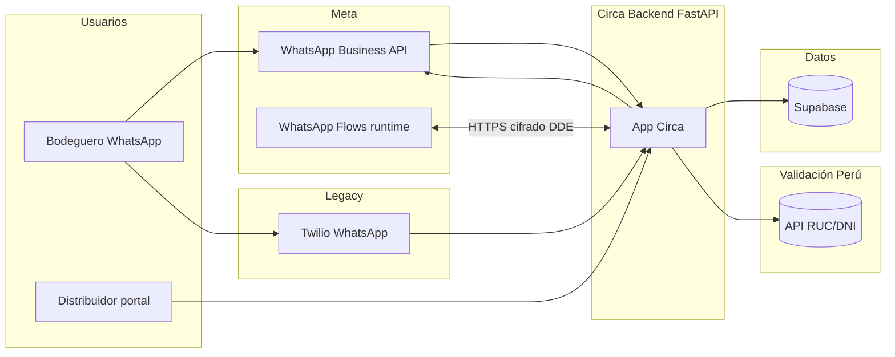

**Leyenda**

- **Meta**: webhook de mensajes + envío de interactivos, plantillas y Flows vía Graph API.
- **Flows runtime**: Meta invoca los endpoints `/flows/*` con payload cifrado (Dynamic Data Exchange).
- **Supabase**: fuente de verdad operativa (bodegas, pedidos, sesiones, catálogo, etc.).
- **Twilio**: webhook `/webhook/twilio` y envío por plantillas Content API (mismo dominio de negocio, otro transporte).

---

## 3. Diagrama de contenedores (nivel medio)

Componentes dentro del proceso FastAPI y fuera.

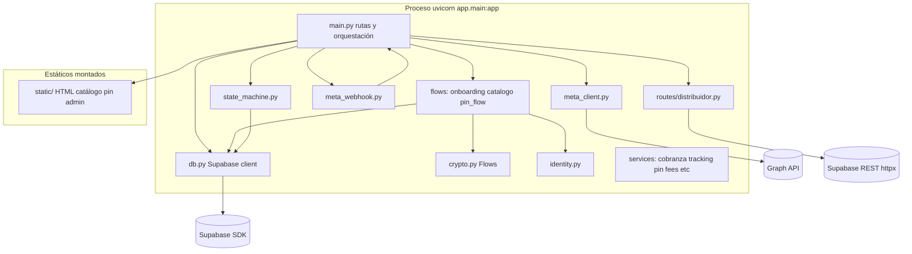

**Notas**

- **`main.py`**: concentra webhooks Meta/Twilio, endpoints `/flows/*`, APIs REST (`/api/*`), páginas legales y `FileResponse` a HTML estático.
- **`distribuidor`**: router propio con cliente HTTP directo a Supabase (además del cliente en `db.py`).
- **`state_machine.py`**: máquina de estados del chat para Twilio y, en parte, señales equivalentes vía Meta.

---

## 4. Flujos de mensajería (bajo nivel)

### 4.1 Entrada Meta (webhook)

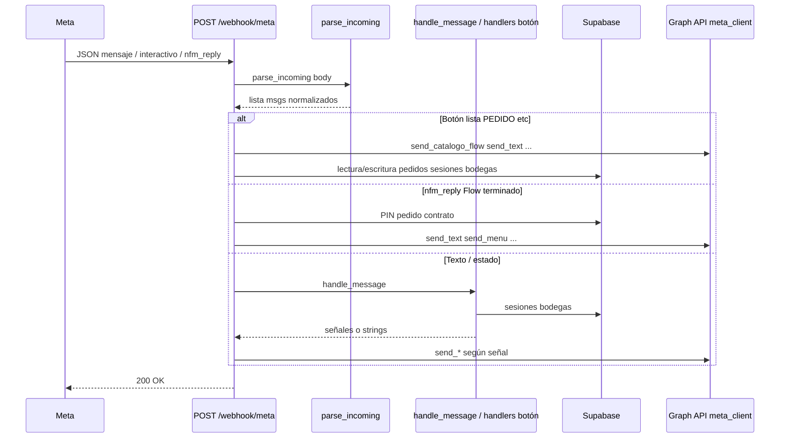

**Puntos clave**

- `interactive.nfm_reply` → `flow_data` + `body` sintético `__FLOW_RESPONSE__` (`meta_webhook.py`).
- Botones `PEDIDO`, `ACEPTO`, `FIN*`, `PAY*`, etc. tratados en `main.py` antes o después de la máquina de estados según el caso.

### 4.2 WhatsApp Flows — Dynamic Data Exchange (DDE)

Meta → servidor cifrado; respuesta cifrada. Sin Graph API en este tramo.

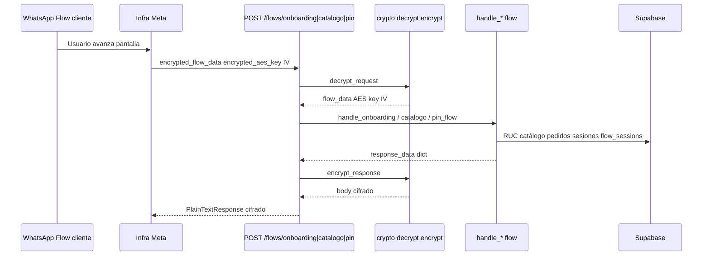

**Dependencias**: `FLOW_PRIVATE_KEY` (PEM RSA), `cryptography`, tablas y RPC acordes con cada handler (`app/flows/*.py`).

### 4.3 Abrir un Flow desde el chat (salida)

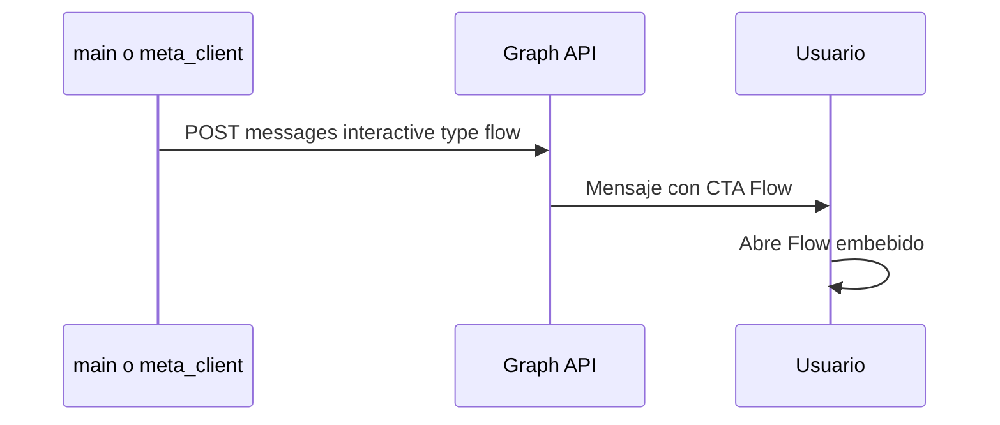

Parámetros relevantes: `flow_id` (env, p. ej. `FLOW_PIN_ID` en `send_pin_request`), `flow_action` / `navigate`, `screen`, `data` inicial.

### 4.4 Twilio (legacy)

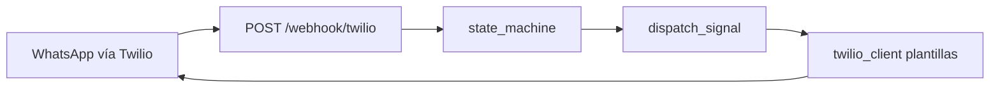

El cuerpo del mensaje se arma con `ButtonPayload`, `ListReply`, etc. (`main.py`).

### 4.5 Catálogo web (complemento)

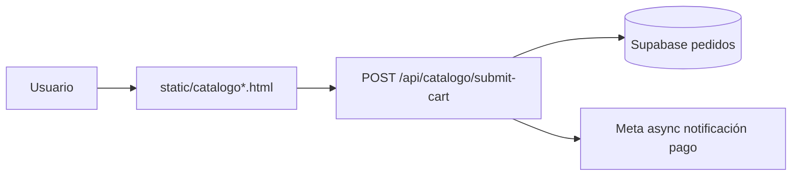

El pedido en borrador y las opciones de pago enlazan con la misma lógica de negocio que el chat Meta.

### 4.6 Capas de software (bajo nivel)

Vista por capas del mismo proceso FastAPI.

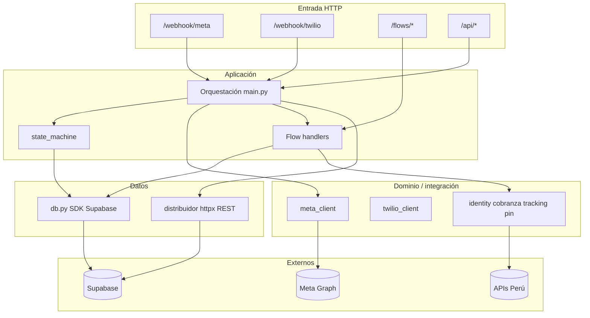

### 4.7 Onboarding Flow — pantallas (referencia `flow_onboarding.json`)

Navegación lógica entre pantallas del Flow; el endpoint dinámico la satisface con `handle_onboarding`.

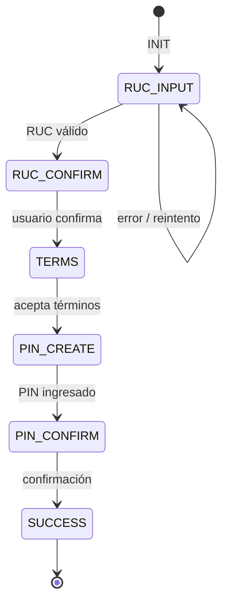

### 4.8 Pago financiado — secuencia simplificada (Meta + PIN)

Después de elegir plazo en lista; alineado con handlers en `main.py` (sesión `pin_pago`, confirmación de pedido).

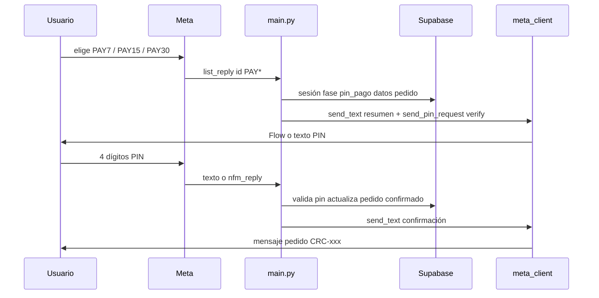

### 4.9 Dependencias entre paquetes Python (bajo nivel)

Imports típicos entre módulos propios (no incluye `fastapi`, `httpx`, etc.).

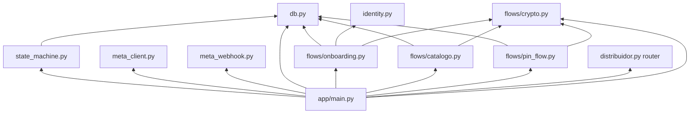

---

## 5. Modelo de datos lógico (bajo nivel, simplificado)

Entidades tocadas de forma recurrente (nombres según uso en código; el esquema exacto está en Supabase).

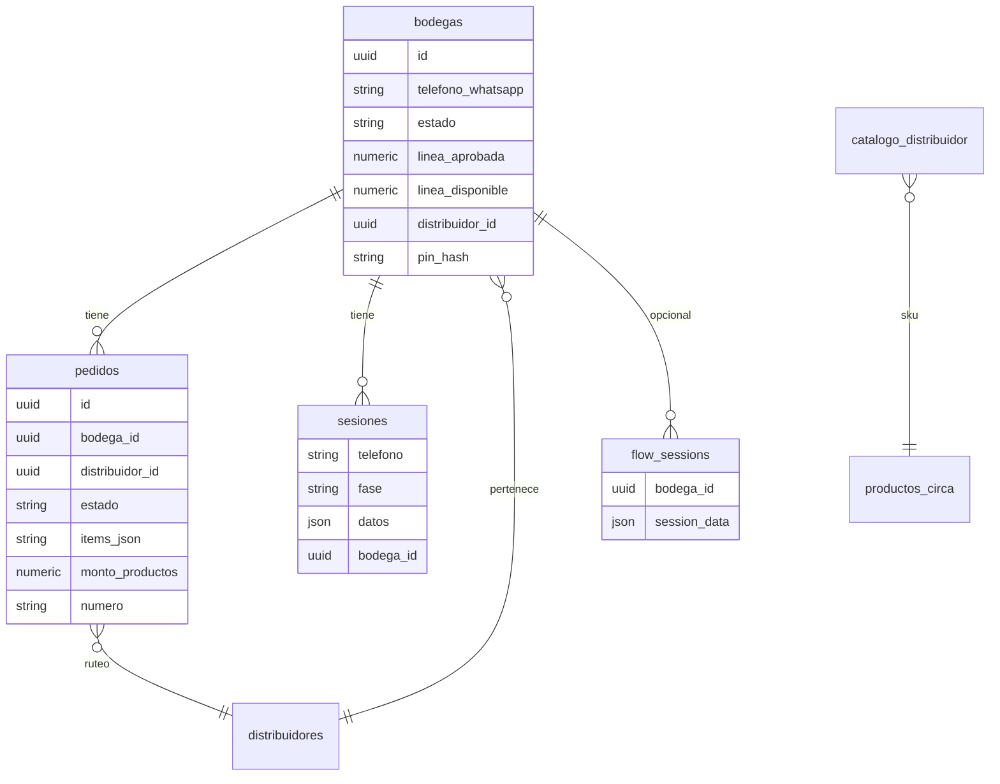

**RPC**: `pin_flow.py` puede usar `db.sb.rpc("gen_numero_pedido")` según entorno.

---

## 6. Mapa de rutas HTTP (referencia rápida)

| Área | Rutas típicas |
|------|----------------|
| Salud / legales | `GET /api/health`, `/privacy`, `/terms`, `/data-deletion` |
| Twilio | `POST /webhook/twilio` |
| Meta | `GET|POST /webhook/meta` |
| Flows DDE | `POST /flows/onboarding`, `/flows/catalogo`, `/flows/pin` |
| Pedidos / bodegas / catálogo API | `GET/POST /api/pedidos*`, `/api/bodegas*`, `/api/catalogo*` |
| Cobranza | `POST /api/cobranza/*`, `GET /api/cobranza/*` |
| PIN web | `GET /pin`, `POST /api/pin/*` |
| Distribuidor | `/api/distribuidor/*` (header `X-API-Token`) |
| Estáticos | `GET /catalogo`, `/catalogo-v2`, `mount /static` |

---

## 7. Variables de entorno (agrupadas)

| Grupo | Variables (ejemplos en código) |
|-------|----------------------------------|
| Supabase | `SUPABASE_URL`, `SUPABASE_SERVICE_KEY` |
| Meta | `META_ACCESS_TOKEN`, `META_PHONE_NUMBER_ID`, `META_APP_SECRET`, `META_VERIFY_TOKEN`, `META_WABA_ID` |
| Flows | `FLOW_PRIVATE_KEY`, `FLOW_ONBOARDING_ID`, `FLOW_CATALOGO_ID`, `FLOW_PIN_ID` (PIN en `meta_client`) |
| App | `APP_BASE_URL` |
| Twilio | `TWILIO_ACCOUNT_SID`, `TWILIO_AUTH_TOKEN`, `TWILIO_WHATSAPP_FROM`, plantillas `TWILIO_TEMPLATE_*` |
| Identidad | `PERU_API_PROVIDER`, `PERU_API_TOKEN` |
| Pagos UX | `YAPE_PHONE`, `PLIN_PHONE`, `DISTRIBUIDOR_WA_NUMERO` |

Ver también `.env.example` (puede estar incompleto respecto a Meta/Flows; conviene alinearlo con `app/config.py`).

---

## 8. Despliegue y runtime

- **Proceso**: `Procfile` → `uvicorn app.main:app --host 0.0.0.0 --port $PORT`.
- **Contenedor**: `Dockerfile` (Python 3.12, mismo comando uvicorn).
- **Requisitos**: `requirements.txt` (FastAPI, uvicorn, supabase, httpx, cryptography, bcrypt, twilio, reportlab, etc.).

**Requisitos de red**: HTTPS público para webhooks Meta, Twilio (si aplica) y endpoints `/flows/*`.

---

## 9. Riesgos y duplicación conscientes

- **Dos clientes Supabase**: SDK en `db.py` vs REST en `routes/distribuidor.py` (mismos datos, distinta capa; revisar URLs y claves por entorno).
- **Meta + Twilio**: dos implementaciones del dominio conversacional; cambios de producto pueden requerir tocar ambos o priorizar solo Meta.
- **Catálogo**: Flow dinámico (`handle_catalogo`) vs página web (`catalogo-v2`); conviene documentar cuál es el canal oficial por entorno.

---

## 10. Referencias internas

- Planes de producto: `CIRCA_PLAN_MAESTRO_v2.md`, `CIRCA_PLAN_MAESTRO_WHATSAPP_FLOWS.md`.
- Definiciones JSON de Flow (referencia/import): `app/flows/flow_onboarding.json`, `app/flows/flow_catalogo.json`.

---

*Última actualización alineada con el árbol de código del repositorio Circa Production.*
