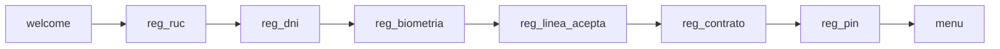
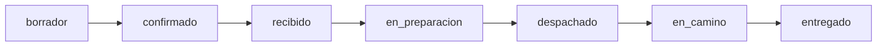
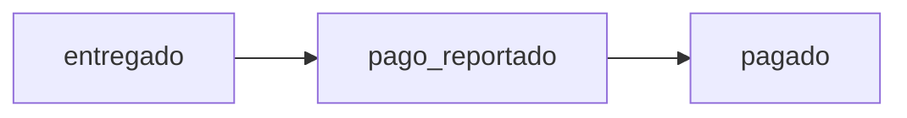
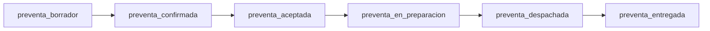
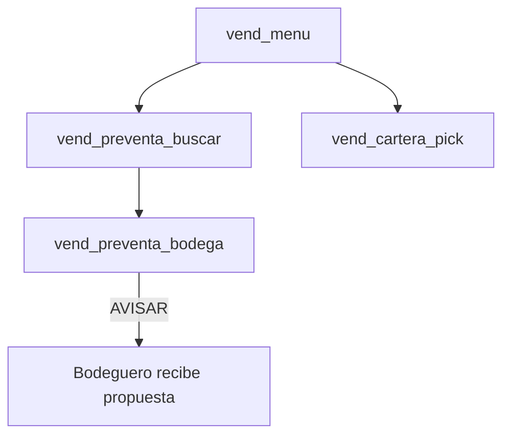
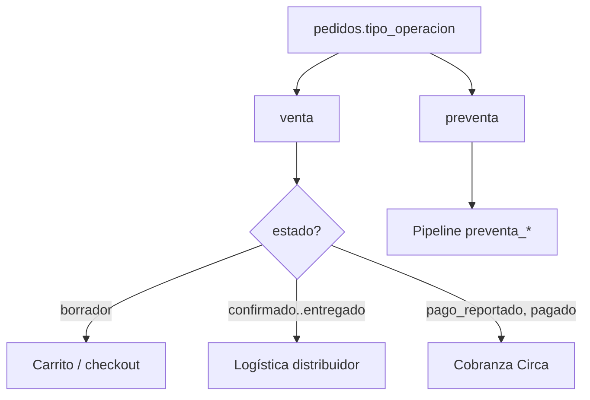

# Estados por journey — Circa

Guía de referencia para entender **en qué paso está** cada actor (bodeguero, distribuidor, vendedor, soporte) y qué campo en base de datos lo representa.

**Código fuente de verdad (pedidos logística):**

| Módulo | Archivo |
|--------|---------|
| Flujo venta (portal distribuidor) | `app/services/order_status.py` |
| Diagrama backoffice (BPMN) | `app/services/pedido_flow.py` |
| Chat WhatsApp bodeguero | `app/state_machine.py` (`sesiones.fase`) |
| Vendedor de campo (WA) | `app/services/vendedor_wa.py` |

**UI:** en `/backoffice` → pestaña **Pedidos** → clic en el número → diagrama de progreso.

---

## Convenciones

| Concepto | Tabla / campo | Uso |
|----------|---------------|-----|
| **Estado de pedido** | `pedidos.estado` | Ciclo de vida del pedido (venta o preventa) |
| **Fase de sesión WA** | `sesiones.fase` | Dónde está el bot en la conversación (temporal) |
| **Estado de bodega** | `bodegas.estado` | Si puede operar (activo, preaprobada, etc.) |
| **Tipo de operación** | `pedidos.tipo_operacion` | `venta` o `preventa` |

Las transiciones **lineales** del distribuidor (portal) están en `STATUS_FLOW`. El backoffice y la API `/api/backoffice/pedido/{id}/flujo` usan el mismo vocabulario.

---

## 1. Onboarding bodega (WhatsApp)

Journey: usuario nuevo → cuenta activa con línea y PIN.

### 1.1 Estado de la bodega (`bodegas.estado`)

| Estado | Significado |
|--------|-------------|
| `preaprobada` | Alta en sistema; aún no completó onboarding WA |
| `activo` | Onboarding completo (PIN creado); puede pedir y financiar |
| `inactivo` | Cuenta sin activar o reset de demo |
| `suspendido` / `bloqueado` | Bloqueo operativo (soporte / riesgo) |

### 1.2 Fases del bot (`sesiones.fase`) — onboarding

| Fase | Qué hace el usuario | Siguiente |
|------|---------------------|-----------|
| `welcome` | Primer contacto | `reg_ruc` |
| `reg_ruc` | Envía RUC (validación SUNAT) | `reg_dni` |
| `reg_dni` | DNI del representante | `reg_biometria` |
| `reg_biometria` | Selfie / validación (si aplica) | `reg_linea_acepta` |
| `reg_linea_acepta` | Acepta monto de línea | `reg_contrato` |
| `reg_contrato` | Recibe PDF; botón **ACEPTO** | `reg_pin` |
| `reg_pin` | Crea PIN de 4 dígitos (Flow o web) | `menu` |
| `reset_clave` | Flujo “olvidé mi clave” | `reg_pin` |

Al terminar: `bodegas.estado = activo`, `sesiones.fase = menu`.

**Doc detallada:** [`docs/flows/01-onboarding.md`](flows/01-onboarding.md)

---

## 2. Venta — pedido confirmado (journey principal)

`tipo_operacion = venta`. Tras confirmar con PIN, el pedido entra en logística del distribuidor.

### 2.1 Pipeline canónico (`pedidos.estado`)

| # | Estado | Etiqueta UI | Quién avanza | Notas |
|---|--------|-------------|--------------|-------|
| 0 | `borrador` | Borrador | Bodeguero (catálogo) | Carrito sin confirmar; no aparece en portal distribuidor |
| 1 | `confirmado` | Nuevo | Sistema (PIN OK) | Pedido creado; distribuidor lo ve |
| 2 | `recibido` | Recibido | Distribuidor | Ack de recepción |
| 3 | `en_preparacion` | Preparación | Distribuidor | Armado en almacén |
| 4 | `despachado` | Despachado | Distribuidor | Salió del almacén |
| 5 | `en_camino` | En camino | Distribuidor | Reparto hacia bodega |
| 6 | `entregado` | Entregado | Distribuidor | Cierre logístico |

**Regla:** solo se permite el **siguiente** estado en `STATUS_FLOW` (salvo `force` en backoffice).

### 2.2 Fase previa: carrito y pago (sesión WA / web)

Antes de `confirmado`, la sesión puede estar en:

| Fase sesión | Momento |
|-------------|---------|
| `menu` | Menú principal; elige PEDIDO / REPETIR |
| `pin_pago` | Eligió contado o financiación; espera PIN |
| `fin_plazo` | Eligió % a financiar; elige 7/15/30 días |
| `pin_confirm` | Confirmación vía web `/pin` (legacy) |

El catálogo web (`/catalogo-v2`) crea el pedido en `borrador` vía `POST /api/catalogo/submit-cart`.

### 2.3 Cobranza (solo si `monto_financiado > 0`)

Después de `entregado`:

| Estado | Significado | Quién |
|--------|-------------|-------|
| `pago_reportado` | Bodeguero tocó “Ya pagué” o reportó pago | Bodeguero |
| `pagado` | Circa verificó el pago; línea restaurada | Backoffice / cobranza |

Si el pedido es **100% contado** (`monto_financiado = 0`), el journey termina en `entregado`.

**Doc:** [`docs/flows/05-postventa-cobranza.md`](flows/05-postventa-cobranza.md)

### 2.4 Estados terminales / excepción (venta)

| Estado | Tipo |
|--------|------|
| `cancelado` / `rechazado` | Fin fallido |
| `en_mora` | Cobranza vencida (financiamiento) |
| `aprobado` | Legacy (alias → tratar como `confirmado`) |
| `preparando` | Legacy API tracking (alias → `en_preparacion`) |

---

## 3. Pre-venta (`tipo_operacion = preventa`)

Pedido armado antes de la visita del distribuidor o por vendedor de campo. Estados con prefijo `preventa_`.

| # | Estado | Significado | Quién avanza |
|---|--------|-------------|--------------|
| 1 | `preventa_borrador` | Carrito preventa sin confirmar | Bodeguero / catálogo |
| 2 | `preventa_confirmada` | Bodeguero confirmó con PIN (o vendedor armó pedido) | Bodeguero / vendedor app |
| 3 | `preventa_aceptada` | Distribuidor o backoffice aceptó la preventa | Backoffice “Aceptar” / API |
| 4 | `preventa_en_preparacion` | En almacén | Distribuidor |
| 5 | `preventa_despachada` | Despachada | Distribuidor |
| 6 | `preventa_entregada` | Entregada en bodega | Distribuidor |

**Terminales:**

| Estado | Significado |
|--------|-------------|
| `preventa_rechazada` | Bodeguero rechazó propuesta (link `Pedido {token}`) |
| `preventa_cancelada` | Cancelada en backoffice (estados cancelables definidos en `PREVENTA_CANCEL_STATES`) |

**Orígenes comunes:** `preventa_dimax` (Excel ERP), `preventa_vendedor_app`, catálogo web `tipo=preventa`.

**Doc:** [`docs/flows/04-preventa.md`](flows/04-preventa.md)

---

## 4. Vendedor de campo (WhatsApp)

Actor distinto al bodeguero. Usa `sesiones.fase` con prefijo `vend_*` (misma tabla `sesiones`, otro teléfono).

| Fase | Acción |
|------|--------|
| `vend_menu` | Menú vendedor (preventa nueva, cartera, etc.) |
| `vend_preventa_buscar` | Busca bodega por nombre/RUC |
| `vend_preventa_bodega` | Arma preventa para bodega elegida |
| `vend_cartera_pick` | Elige bodega de su cartera |

El pedido resultante suele quedar en `preventa_confirmada` con `origen = preventa_vendedor_app`.

**Código:** `app/services/vendedor_wa.py` · migración `migrations/20260609_sesion_fase_vendedor_wa.sql`

---

## 5. Distribuidor (portal)

No usa `sesiones`; solo actualiza `pedidos.estado` según `STATUS_FLOW`.

| Acción en UI | Transición |
|--------------|------------|
| Marcar recibido | `confirmado` → `recibido` |
| Iniciar preparación | `recibido` → `en_preparacion` |
| Despachar | `en_preparacion` → `despachado` |
| En camino | `despachado` → `en_camino` |
| Confirmar entrega | `en_camino` → `entregado` |

**UI:** `/static/distribuidor.html` · **API:** `POST /api/distribuidor/pedidos/{id}/status`

---

## 6. Backoffice — vista de progreso

| Dónde | Qué muestra |
|-------|-------------|
| Pedidos → columna **Progreso** | Barra + `paso/total` |
| Clic en número de pedido | Modal BPMN por fases |
| Perfil bodega → pestaña Pedidos | Misma barra y modal |

**API:** `GET /api/backoffice/pedido/{id}/flujo`

Respuesta incluye: `steps[]` (done / current / pending), `percent`, `remaining_steps`, `phases[]` (Logística, Cobranza, Pre-venta).

---

## 7. Mapa rápido: ¿qué journey es este pedido?

| Pregunta | Mirar |
|----------|--------|
| ¿El bot qué le pregunta al usuario? | `sesiones.fase` |
| ¿El pedido ya salió del almacén? | `en_preparacion` o posterior |
| ¿Falta pagar a Circa? | `monto_financiado > 0` y estado antes de `pagado` |
| ¿Es preventa DIMAX pendiente de aceptar? | `preventa_confirmada` + origen `preventa_dimax` |

---

## 8. Relación con otros documentos

| Documento | Contenido |
|-----------|-----------|
| [FigJam — Journey Estados](https://www.figma.com/board/i2qYZinZfLtkmZmLC8Lx7K) | Diagramas de flujo por journey (mismo contenido que las secciones 1–7) |
| [`docs/flows/README.md`](flows/README.md) | Matriz de escenarios (ONB-*, CAT-*, PRV-*, POS-*) |
| [`docs/REFERENCIA_TECNICA.md`](REFERENCIA_TECNICA.md) | Schema DB y enums históricos |
| [`arquitectura.md`](../arquitectura.md) | Diagramas de módulos |

---

## Changelog de vocabulario

| Fecha | Cambio |
|-------|--------|
| 2026-06 | `order_status.py` unifica portal distribuidor y API tracking |
| 2026-06 | Backoffice muestra BPMN vía `pedido_flow.py` |
| 2026-06 | Multi-distribuidor: routing por productos, no por `es_test` → ZOOM |

Si agregas un valor a `pedido_estado` o `sesion_fase`, actualiza este archivo y `pedido_flow.py` / `order_status.py` según corresponda.
