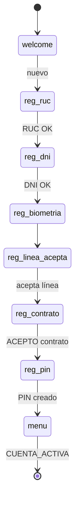

# 01 — Onboarding y activación

| | |
|--|--|
| **Figma** | [Wireframes Onboarding](https://www.figma.com/design/8uXIOxgppRe67aNbThSyv6) · [Spec WhatsApp](./figma/01-onboarding-whatsapp.md) · [YAML pantallas](./figma/onboarding-screens.yaml) |
| **Escenarios** | ONB-01 … ONB-11 |
| **Código** | `app/state_machine.py` (`welcome`, `reg_*`), `app/flows/onboarding.py`, `app/flows/flow_onboarding.json` |
| **Endpoint Flow** | `POST /flows/onboarding` |

## Objetivo

Registrar una bodega preaprobada, validar identidad, firmar contrato, crear PIN y dejar `estado=activo` con línea disponible.

## Flujo (chat + Flow Meta)

Detalle pantallas Flow: ver diagrama en [`arquitectura.md` §4.7](../../arquitectura.md).

## Wireframes WhatsApp

Conversación completa (16 pantallas happy path + 6 errores): ver [spec Figma](./figma/01-onboarding-whatsapp.md).

| Pantalla | ID escenario | Notas |
|----------|--------------|-------|
| Bienvenida + pedir RUC | ONB-01, ONB-02 | `button_reply` + texto RUC |
| Verificación DNI foto | ONB-04 | Imagen DNI → Vision |
| Oferta línea S/XXX | ONB-06 | Botones Continuar / No gracias |
| Contrato + ACEPTO | ONB-07 | `button_reply` |
| Crear PIN (Flow) | ONB-08 | `/flows/pin` mode create |
| Menú activo | ONB-09 | `list_reply` |

## Checklist por escenario

| ID | Verificación |
|----|----------------|
| ONB-02 | RUC en lista preaprobada → continúa |
| ONB-03 | RUC desconocido → mensaje rechazo |
| ONB-07 | PDF generado, hash guardado |
| ONB-09 | Tras PIN, menú con línea correcta |
| ONB-11 | OLVIDE → flujo DNI reset, PIN nuevo |

## Estados BD relevantes

- `bodegas.estado`: → `activo`
- `bodegas.pin_hash`, `linea_aprobada`, `linea_disponible`
- `sesiones.fase`: transiciones `reg_*` → `menu`

[← Índice](./README.md)
