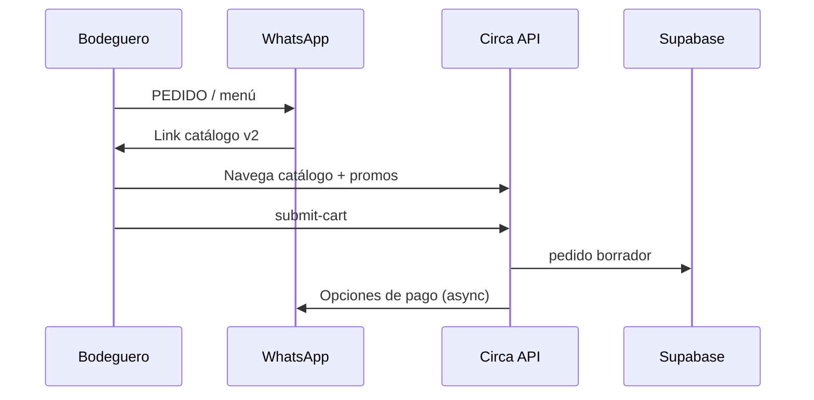

# 02 — Catálogo y pedido

| | |
|--|--|
| **Figma** | [Wireframes — página 03 Catalogo](https://www.figma.com/design/8uXIOxgppRe67aNbThSyv6) · [Spec WhatsApp](./figma/02-catalogo-whatsapp.md) |
| **Escenarios** | CAT-01 … CAT-09 |
| **Código** | `static/catalogo_v2.html`, `POST /api/catalogo/submit-cart`, `app/state_machine.py` (menú, REPETIR) |
| **URL** | `/catalogo-v2?b=…&t=venta|preventa` — `fresh=1` pedido nuevo, `repeat=1` REPETIR, `edit=1` EDITAR |

## Objetivo

Armar pedido en web dentro de WhatsApp, persistir borrador en Supabase, asignar distribuidor correcto, disparar opciones de pago (venta) o flujo preventa.

## Flujo venta (happy path)

## Routing distribuidor (CAT-04)

| Bodega | `pedidos.distribuidor_id` |
|--------|---------------------------|
| `es_test=true` | Zoom |
| Real (piloto o no) | DIMAX |
| Catálogo/promos (todos) | DIMAX |

Código: `app/services/distribuidor_routing.py`

## Wireframes (placeholder)

| Pantalla | ID | Notas |
|----------|-----|-------|
| Menú principal lista | CAT-01 | `send_menu` |
| Catálogo v2 grid + carrito | CAT-02 | promos, búsqueda |
| Confirmar carrito web | CAT-03 | CTA Financiar con Circa |
| Mensaje REPETIR + link | CAT-07 | `repeat=1` |

## Checklist

| ID | Verificación |
|----|----------------|
| CAT-03 | `estado=borrador`, items y total coherentes |
| CAT-04 | Portal DIMAX muestra pedido (piloto real) |
| CAT-07 | No carga preventa; solo última venta confirmada |
| CAT-09 | EDITAR vuelve a catálogo con sesión |

[← Índice](./README.md)
