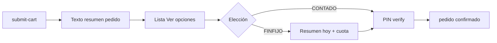

# 03 — Pago y confirmación (PIN)

| | |
|--|--|
| **Figma** | [Wireframes — página 04 Pago](https://www.figma.com/design/8uXIOxgppRe67aNbThSyv6) · [Spec WhatsApp](./figma/03-pago-whatsapp.md) |
| **Escenarios** | PAY-01 … PAY-09 |
| **Código** | `app/flows/catalogo.py` (`_send_payment_options`), `app/main.py` (CONTADO/FINFIJO/PAY*), `app/flows/pin_flow.py` |

## Objetivo

Elegir contado o financiamiento parcial, confirmar con PIN de 4 dígitos, congelar fee según plan (7/15/30 días).

## Lista de pago (venta)

Orden actual de filas (`PAY-01`):

1. **Pago todo hoy** (contado)
2. Financiar S/500 … S/100 (mayor a menor)
3. Editar carrito

## Fees (PAY-08)

| Plazo | Comisión |
|-------|----------|
| 7 d | 1.4% (mín. S/1) |
| 15 d | 3% |
| 30 d | 6% |

Mora post-vencimiento: 0.03%/día. Campo `pedidos.fee_regimen` (migración `20260520`).

## Wireframes (placeholder)

| Pantalla | ID |
|----------|-----|
| Lista interactiva opciones | PAY-01–05 |
| Resumen financiar + PIN nativo | PAY-03, PAY-07 |
| Flow PIN overlay | PAY-07 |

## Checklist

| ID | Verificación |
|----|----------------|
| PAY-01 | Primera fila = Pago todo hoy |
| PAY-02 | Contado → `monto_financiado=0`, PIN OK |
| PAY-03 | Tramo ≤ línea y ≤ total |
| PAY-05 | Sin línea: mensaje solo contado |
| PAY-07 | Tras PIN: `confirmado`, snapshot items venta |

[← Índice](./README.md)
