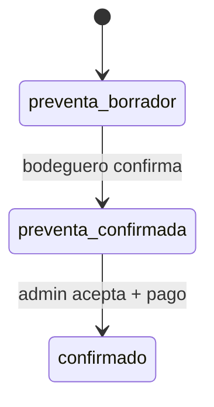

# 04 — Preventa

| | |
|--|--|
| **Figma** | *[pendiente — página «04 Preventa»]* |
| **Escenarios** | PRV-01 … PRV-06 |
| **Código** | `tipo_operacion=preventa`, `db.get_preventa_pendiente`, `app/routes/distribuidor.py` admin |

## Objetivo

Solicitud de preventa sin pago inmediato; aprobación admin; pago posterior vía menú «Pagar mi preventa».

## Estados pedido

## Diferencias vs venta

| | Venta | Preventa |
|--|-------|----------|
| URL catálogo | `t=venta` | `t=preventa` |
| Tras submit | Opciones de pago al instante | Confirmación sin pago (PRV-03) |
| Pago | En checkout | Menú `PAGAR_PREVENTA_*` (PRV-05) |
| Número pedido | CRC-* | PRV-* |

## Checklist

| ID | Verificación |
|----|----------------|
| PRV-01 | Catálogo en modo preventa |
| PRV-04 | Admin acepta → visible para pago |
| PRV-05 | Una sola preventa pendiente por bodega |
| PRV-06 | Import Excel crea/actualiza según spec |

[← Índice](./README.md)
