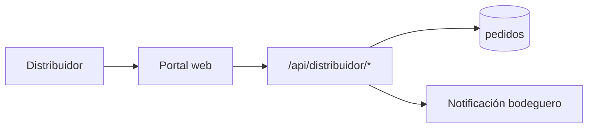

# 06 — Portal distribuidor

| | |
|--|--|
| **Figma** | *[pendiente — página «06 Distribuidor»]* |
| **Escenarios** | DIS-01 … DIS-05 |
| **Código** | `app/routes/distribuidor.py`, `static/distribuidor.html` |
| **URL** | `/static/distribuidor.html` |

## Objetivo

Que Zoom/DIMAX vean solo sus pedidos (`pedidos.distribuidor_id`), actualicen estado y exporten datos.

## Flujo

## Checklist

| ID | Verificación |
|----|----------------|
| DIS-02 | Token solo ve pedidos de su `distribuidor_id` |
| DIS-03 | Transiciones válidas de estado |
| DIS-04 | Bodeguero recibe mensaje WA al cambiar estado |

[← Índice](./README.md)
