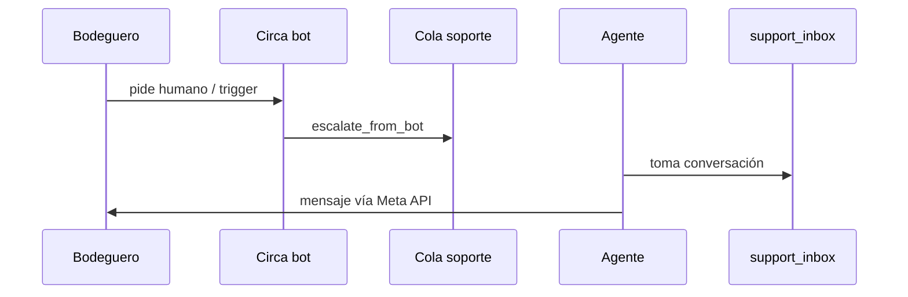

# 08 — Soporte humano

| | |
|--|--|
| **Figma** | *[pendiente — página «08 Soporte»]* |
| **Escenarios** | SUP-01 … SUP-03 |
| **Código** | `app/support/`, `app/routes/support_inbox.py`, `GET /support` |

## Objetivo

Escalar conversaciones del bot a agentes; responder desde inbox web sin romper el hilo WhatsApp.

## Flujo

## Escenarios

| ID | Trigger |
|----|---------|
| SUP-01 | Handover automático o keyword |
| SUP-02 | Agente envía texto desde `/support` |
| SUP-03 | `CONTACT_CIRCA` — link WA soporte en cualquier fase |

## Checklist

| ID | Verificación |
|----|----------------|
| SUP-02 | Mensaje aparece en WA y en `support_messages` |
| SUP-03 | Link abre chat soporte correcto |

[← Índice](./README.md)
