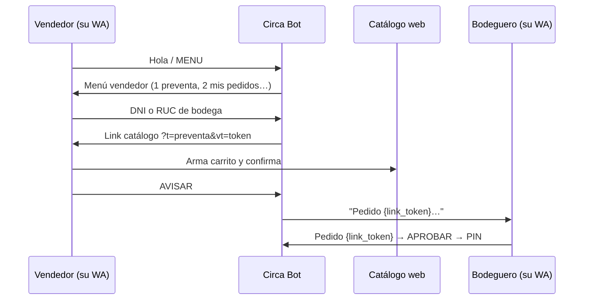

# Flujo 10 — Vendedor por WhatsApp

El vendedor de campo opera desde **su propio WhatsApp** (no el del bodeguero). Circa lo reconoce por `vendedores.telefono_whatsapp`.

## Alta

1. Backoffice → **Vendedores** → crear vendedor con **WhatsApp vendedor**
2. Asignar **cartera** (`bodega_vendedores`)
3. Aplicar migración `migrations/20260603_vendedores_telefono_whatsapp.sql` en Supabase

## Secuencia

## Comandos vendedor

| Comando | Acción |
|---------|--------|
| `MENU` / `VENDEDOR` | Menú principal |
| `1` / `PREVENTA` | Buscar bodega (DNI/RUC) |
| `2` / `MIS PREVENTAS` | Últimas preventas del vendedor |
| `3` / `BODEGAS` | Cartera asignada |
| `AVISAR` | Notifica al bodeguero por WhatsApp |
| DNI/RUC (8 u 11 dígitos) | Atajo desde menú → catálogo |

## Teléfono dual (vendedor + bodega)

Si el mismo número está en `vendedores` y `bodegas`, al primer mensaje Circa pregunta:

- `1` / `VENDEDOR` → modo vendedor  
- `2` / `BODEGA` → modo bodeguero (flujo existente)

## Código

| Pieza | Archivo |
|-------|---------|
| Lógica WA vendedor | `app/services/vendedor_wa.py` |
| Routing en bot | `app/state_machine.py` |
| Notificación bodeguero | signal `VEND_NOTIFY_BODEGA` en `app/main.py` |
| Lookup teléfono | `db.get_vendedor_by_phone()` |

## Escenarios de prueba (VEND-WA)

| ID | Paso |
|----|------|
| VEND-WA-01 | Vendedor con tel registrado escribe MENU → menú vendedor |
| VEND-WA-02 | Envía RUC válido en cartera → link catálogo |
| VEND-WA-03 | Tras crear pedido en web, AVISAR → bodeguero recibe mensaje |
| VEND-WA-04 | Bodeguero responde Pedido {token} → aprobar_preventa |
| VEND-WA-05 | Tel dual → chooser 1/2 |
