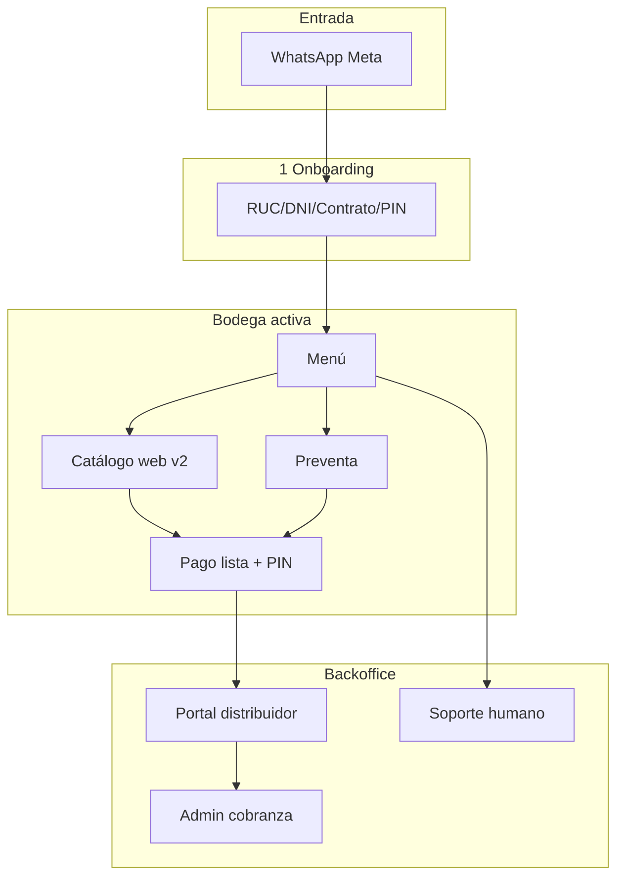

# Circa — Mapa de flujos y escenarios

Índice maestro de journeys, wireframes y seguimiento de escenarios.  
**Arquitectura técnica:** [`arquitectura.md`](../../arquitectura.md) · **Plan histórico Flows:** [`CIRCA_PLAN_MAESTRO_WHATSAPP_FLOWS.md`](../../CIRCA_PLAN_MAESTRO_WHATSAPP_FLOWS.md)

---

## Cómo usar este directorio

| Archivo | Contenido |
|---------|-----------|
| Este `README.md` | Matriz de todos los escenarios (filtrar por journey / grupo / estado) |
| [`scenarios.yaml`](./scenarios.yaml) | Misma matriz en YAML (IDs estables, scripts/checklists) |
| `01-…` → `09-…` | Detalle por journey: diagrama, código, checklist P0 |
| [`figma/`](./figma/README.md) | **Guía maestra Figma:** wireframes, diagramas, componentes, journeys funcional + técnico, file keys MCP |

**Wireframes visuales (Figma):** ver [`figma/README.md`](./figma/README.md) — onboarding wireframeado; catálogo/pago/preventa/postventa con spec listo para diseñar.  
**Regla de PR:** si cambia UX o un camino de usuario, actualizar la fila del escenario, el `.md` del journey y el spec en `figma/` si aplica.

### Leyenda de estado

| Símbolo | Significado |
|---------|-------------|
| ✅ | Implementado y alineado con prod |
| 🟡 | Parcial o solo un canal (web vs chat) |
| 📋 | Especificado / plan, no verificado en prod |
| 🔴 | Bug conocido o desalineado |
| ⛔ | Deprecado (Twilio, Flow viejo) |

### Grupos (para agrupar en Notion/Sheets)

`Onboarding` · `Catálogo` · `Pago` · `Crédito` · `Preventa` · `Postventa` · `Distribuidor` · `Admin` · `Soporte` · `UX` · `Piloto` · `Legacy`

### Actores

| Actor | Uso en pruebas |
|-------|----------------|
| `bodega_piloto` | `en_piloto=true`, `es_test=false` |
| `bodega_test` | `es_test=true` → pedidos Zoom |
| `bodega_fuera_piloto` | resto de reales |
| `distribuidor` | portal + API token |
| `agente_soporte` | `/support` |
| `admin` | panel admin / endpoints cobranza |

---

## Journeys

| # | Journey | Doc | Código principal |
|---|---------|-----|------------------|
| 1 | Onboarding y activación | [01-onboarding.md](./01-onboarding.md) | `state_machine.py` (`reg_*`), `flows/onboarding.py`, `flow_onboarding.json` |
| 2 | Catálogo y pedido | [02-catalogo-pedido.md](./02-catalogo-pedido.md) | `static/catalogo_v2.html`, `submit-cart`, `state_machine` (`catalogo*`) |
| 3 | Pago y PIN | [03-pago-pin.md](./03-pago-pin.md) | `catalogo._send_payment_options`, `main.py` handlers, `pin_flow.py` |
| 4 | Preventa | [04-preventa.md](./04-preventa.md) | `tipo_operacion=preventa`, `get_preventa_pendiente`, admin aceptar |
| 5 | Postventa y cobranza | [05-postventa-cobranza.md](./05-postventa-cobranza.md) | menú ESTADO/PAGUE, `cobranza.py`, APIs cobranza |
| 6 | Distribuidor | [06-distribuidor.md](./06-distribuidor.md) | `routes/distribuidor.py`, `static/distribuidor.html` |
| 7 | Admin y ops | [07-admin-ops.md](./07-admin-ops.md) | admin endpoints, migraciones, routing DIMAX/Zoom |
| 8 | Soporte humano | [08-soporte.md](./08-soporte.md) | `support/`, `/support` |
| 9 | Legacy Twilio / Flow chat | [09-legacy.md](./09-legacy.md) | `/webhook/twilio`, catálogo Flow JSON |

---

## Matriz de escenarios

Columnas abreviadas: **ID** · **Escenario** · **Journey** · **Grupo** · **Actor** · **P** · **Estado** · **Código**

| ID | Escenario | Journey | Grupo | Actor | P | Estado | Código / notas |
|----|-----------|---------|-------|-------|---|--------|----------------|
| ONB-01 | Bienvenida usuario sin bodega | Onboarding | Onboarding | nuevo | P0 | ✅ | `fase=welcome` → `WELCOME` |
| ONB-02 | Registro RUC preaprobado | Onboarding | Onboarding | nuevo | P0 | ✅ | `reg_ruc`, ApiInti |
| ONB-03 | RUC no preaprobado / rechazo | Onboarding | Onboarding | nuevo | P1 | ✅ | `reg_ruc` |
| ONB-04 | DNI representante + validación | Onboarding | Onboarding | nuevo | P0 | ✅ | `reg_dni`, Vision |
| ONB-05 | Biometría / selfie (si aplica) | Onboarding | Onboarding | nuevo | P1 | 🟡 | `reg_biometria` |
| ONB-06 | Oferta de línea y aceptación | Onboarding | Onboarding | nuevo | P0 | ✅ | `reg_linea_acepta` |
| ONB-07 | Contrato PDF + ACEPTO | Onboarding | Onboarding | nuevo | P0 | ✅ | `reg_contrato`, `contract_generator` |
| ONB-08 | Creación PIN 4 dígitos | Onboarding | Onboarding | nuevo | P0 | ✅ | `reg_pin`, Flow `/flows/pin` |
| ONB-09 | Cuenta activa → menú | Onboarding | Onboarding | bodega_activa | P0 | ✅ | `CUENTA_ACTIVA` → `menu` |
| ONB-10 | Flow onboarding Meta (DDE) | Onboarding | Onboarding | nuevo | P1 | 🟡 | `/flows/onboarding` vs chat texto |
| ONB-11 | Reset PIN (OLVIDE) | Onboarding | Onboarding | bodega_activa | P1 | ✅ | menú → `reg_dni` reset |
| CAT-01 | Menú → PEDIDO → URL catálogo v2 venta | Catálogo | Catálogo | bodega_activa | P0 | ✅ | `menu`, `catalogo_v2?t=venta` |
| CAT-02 | Armar carrito web + promos | Catálogo | Catálogo | bodega_activa | P0 | ✅ | `catalogo_v2.html`, promos API |
| CAT-03 | submit-cart crea borrador | Catálogo | Catálogo | bodega_activa | P0 | ✅ | `POST /api/catalogo/submit-cart` |
| CAT-04 | Routing distribuidor pedido (test→Zoom, real→DIMAX) | Catálogo | Piloto | bodega_* | P0 | ✅ | `distribuidor_routing.py` |
| CAT-05 | Catálogo Flow WhatsApp (legacy) | Catálogo | Legacy | bodega_activa | P2 | 🟡 | `/flows/catalogo`, `flow_catalogo.json` |
| CAT-06 | Carrito chat por categorías (Twilio path) | Catálogo | Legacy | bodega_activa | P2 | ⛔ | `fase=catalogo*` + Twilio |
| CAT-07 | REPETIR último pedido venta | Catálogo | UX | bodega_activa | P0 | ✅ | `get_items_para_repetir`, `?repeat=1` |
| CAT-08 | REPETIR sin historial venta | Catálogo | UX | bodega_activa | P1 | ✅ | mensaje “No tienes pedido anterior” |
| CAT-09 | Editar carrito desde lista pago | Catálogo | UX | bodega_activa | P1 | ✅ | `EDITAR_{pid}` |
| PAY-01 | Opciones pago: Pago todo hoy primero | Pago | UX | bodega_activa | P0 | ✅ | `_send_payment_options` |
| PAY-02 | Contado total → PIN | Pago | Pago | bodega_activa | P0 | ✅ | `CONTADO_`, `fase=pin_pago` |
| PAY-03 | Financiar tramo fijo (100–500) 7d | Pago | Crédito | bodega_activa | P0 | ✅ | `FINFIJO*` |
| PAY-04 | Pedido &lt; S/100 solo contado + 7d opcional | Pago | Crédito | bodega_activa | P1 | ✅ | rama `else` tiers vacíos |
| PAY-05 | Sin línea → solo contado + PIN | Pago | Crédito | bodega_activa | P1 | ✅ | `linea <= 0` |
| PAY-06 | Elegir plazo 7/15/30 tras monto (FIN100) | Pago | Crédito | bodega_activa | P2 | 🟡 | `fin_plazo`, `PAY7_`/`PAY15_`/`PAY30_` |
| PAY-07 | Confirmación PIN → pedido confirmado | Pago | Pago | bodega_activa | P0 | ✅ | `pin_flow`, webhook PIN |
| PAY-08 | Fee por plan al confirmar (7/15/30) | Pago | Crédito | bodega_activa | P0 | ✅ | `fees.py`, `fee_regimen` |
| PAY-09 | Delay 2s antes opciones de pago | Pago | UX | bodega_activa | P2 | ✅ | `asyncio.sleep(2)` en `_send_payment_options` |
| PRV-01 | Menú PREVENTA → catálogo `t=preventa` | Preventa | Preventa | bodega_activa | P0 | ✅ | `menu`, preventa URL |
| PRV-02 | submit-cart preventa_borrador | Preventa | Preventa | bodega_activa | P0 | ✅ | `tipo_operacion=preventa` |
| PRV-03 | Confirmación preventa (sin pago inmediato) | Preventa | Preventa | bodega_activa | P0 | 🟡 | flujo distinto a venta |
| PRV-04 | Admin acepta preventa | Preventa | Admin | admin | P0 | ✅ | `/admin/preventa/{id}/aceptar` |
| PRV-05 | Menú “Pagar mi preventa” | Preventa | Preventa | bodega_activa | P0 | ✅ | `PAGAR_PREVENTA_`, `PREVENTA_PAYMENT_OPTIONS` |
| PRV-06 | Import preventas Excel | Preventa | Admin | admin | P2 | ✅ | `/preventas/import` |
| POS-01 | Menú ESTADO pedidos activos | Postventa | Postventa | bodega_activa | P0 | ✅ | `get_pedidos_activos` |
| POS-02 | Menú LINEA (disponible/scoring) | Postventa | UX | bodega_activa | P1 | ✅ | `LINEA_INFO` |
| POS-03 | PAGUE / YA PAGUE → pago_reportado | Postventa | Postventa | bodega_activa | P0 | ✅ | menú `PAGUE` |
| POS-04 | Cobranza recordatorios cron | Postventa | Admin | sistema | P1 | ✅ | `cobranza.py`, APIs |
| POS-05 | Admin verificar pago | Postventa | Admin | admin | P0 | ✅ | `/admin/verificar-pago` |
| POS-06 | Mora post-vencimiento | Postventa | Crédito | bodega_activa | P1 | ✅ | `fees.calcular_total_a_pagar` |
| DIS-01 | Login portal distribuidor (token) | Distribuidor | Distribuidor | distribuidor | P0 | ✅ | `distribuidor.html` |
| DIS-02 | Listar pedidos por distribuidor_id | Distribuidor | Distribuidor | distribuidor | P0 | ✅ | filtro `pedidos.distribuidor_id` |
| DIS-03 | Cambiar estado pedido | Distribuidor | Distribuidor | distribuidor | P0 | ✅ | `POST .../status` |
| DIS-04 | Notificación WA al bodeguero (estado) | Distribuidor | UX | bodega_activa | P1 | ✅ | `update_order_status` |
| DIS-05 | Conciliación / export | Distribuidor | Distribuidor | distribuidor | P2 | ✅ | endpoints conciliación/export |
| ADM-01 | Panel resumen y analytics | Admin | Admin | admin | P1 | ✅ | `/admin/resumen`, analytics |
| ADM-02 | Cobranza lista y acciones | Admin | Admin | admin | P1 | ✅ | `/admin/cobranzas` |
| ADM-03 | Alertas sobregiro | Admin | Admin | admin | P2 | ✅ | `/admin/alerts/sobregiro` |
| ADM-04 | Migración pedidos Zoom→DIMAX solo piloto | Admin | Piloto | admin | P1 | 📋 | `migrations/20260521_...sql` |
| ADM-05 | fee_regimen en pedidos nuevos | Admin | Crédito | admin | P1 | 📋 | `migrations/20260520_...sql` |
| SUP-01 | Escalamiento bot → cola soporte | Soporte | Soporte | bodega_activa | P1 | ✅ | `escalate_from_bot` |
| SUP-02 | Agente responde desde inbox | Soporte | Soporte | agente_soporte | P1 | ✅ | `/support`, `support_inbox` |
| SUP-03 | Contactar a Circa (cualquier fase) | Soporte | UX | bodega_activa | P1 | ✅ | `CONTACT_CIRCA` |
| LEG-01 | Webhook Twilio | Legacy | Legacy | — | P2 | ⛔ | `/webhook/twilio` |
| LEG-02 | Menú interactivo Meta (actual prod) | Legacy | UX | bodega_activa | P0 | ✅ | `meta_client.send_menu` |
| OPS-01 | Latencia respuesta bot (response_time_ms) | Ops | Ops | bodega_test | P2 | 🟡 | `analytics.py` — deploy pendiente verificar |
| OPS-02 | Smoke piloto P0 (10 escenarios) | Ops | Piloto | bodega_piloto | P0 | 📋 | ver checklist abajo |

---

## Smoke checklist — release piloto (P0)

Ejecutar en **bodega piloto** y una **cuenta test** antes de ampliar tráfico:

- [ ] ONB-09 — menú tras activa (si aplica cuenta nueva en staging)
- [ ] CAT-01 + CAT-03 — pedido venta web → borrador
- [ ] CAT-04 — pedido visible en portal **DIMAX** (piloto real)
- [ ] PAY-01 + PAY-02 — contado primero en lista + PIN
- [ ] PAY-03 — financiar S/200 (o tramo válido)
- [ ] PRV-01 + PRV-05 — preventa y pagar preventa
- [ ] DIS-03 — distribuidor marca estado
- [ ] POS-03 — PAGUE en entregado
- [ ] CAT-07 — REPETIR última venta
- [ ] SUP-03 — enlace soporte desde chat

---

## Diagrama de navegación (alto nivel)

---

## Mantenimiento

1. Nuevos escenarios: siguiente ID libre en el journey (`PAY-10`, …).  
2. No reutilizar IDs deprecados; marcar ⛔ y fecha en `scenarios.yaml`.  
3. Enlazar PR/issue: `Notas: #123` en YAML.  
4. **Figma:** una página por journey, nombre de frame = ID de escenario.
