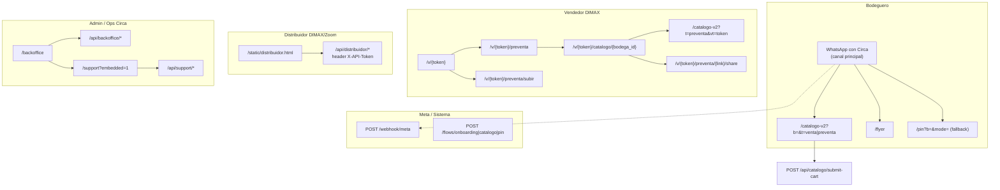

# Diagrama — URLs por actor (Circa Production)

Mapa de **qué URL usa cada tipo de usuario** en producción. Base: `{APP_BASE_URL}` (ej. `https://circa-production-c517.up.railway.app`).

**FigJam:** [Overview Diagramas](https://www.figma.com/board/FNDF15XL6aElJkAv9d7iIs) — diagrama «URLs por actor».

---

## Resumen visual

---

## Tabla maestra por actor

| Actor | Superficie principal | URLs web / app | APIs que consume | Auth |
|-------|---------------------|----------------|------------------|------|
| **Bodeguero** | WhatsApp Business | Ver abajo | vía webhook Meta | Sesión WA + `sesiones.fase` |
| **Vendedor DIMAX** | Web móvil presencial | `/v/{token}/*` | `/v/{token}/api/*` | Token en URL |
| **Distribuidor** | Portal web | `/static/distribuidor.html` | `/api/distribuidor/*` | `X-API-Token` |
| **Admin / Ops Circa** | Backoffice unificado | `/backoffice` (+ pestaña Soporte WA) | `/api/backoffice/*`, `/api/support/*` | Login email/password (JWT) |
| **Meta (sistema)** | Webhooks | — | `GET|POST /webhook/meta` | Verify token / firma |
| **Público** | Legal | `/terms`, `/privacy`, `/data-deletion` | — | — |

---

## 1. Bodeguero

No tiene login web. Opera desde **WhatsApp** con el número Business de Circa.

| Momento | URL / canal | Cómo llega | Código |
|---------|-------------|------------|--------|
| Todo el journey | **WhatsApp chat** | Mensaje al bot | `POST /webhook/meta` → `state_machine.py` |
| Onboarding PIN | **WhatsApp Flow** (nativo) | Botón en chat | `POST /flows/pin` |
| Onboarding (alt.) | `/pin?b={id}&mode=create\|verify&to={bot}` | Link si Flow no disponible | `main.py` `/pin`, `static/pin.html` |
| Pedido / preventa | `/catalogo-v2?b={bodega_id}&t=venta\|preventa` | CTA «Abrir catálogo» in-app WA | `send_catalogo_flow`, `catalog_urls.py` |
| Repetir pedido | `...&repeat=1` | Menú REPETIR | `build_catalog_v2_url` |
| Editar carrito | `...&edit=1` | Lista pago EDITAR | idem |
| Pedido nuevo | `...&fresh=1` | Menú PEDIDO | idem |
| Promos / flyer | `/flyer` | Menú VER_PROMOS → CTA | `send_flyer_link` |
| Confirmar carrito | `POST /api/catalogo/submit-cart` | Desde catálogo web | `main.py` |
| Catálogo legacy | `/catalogo` | ⛔ deprecado | `static/catalogo.html` |

**Query params catálogo v2:**

| Param | Valor | Uso |
|-------|-------|-----|
| `b` | UUID bodega | Obligatorio |
| `t` | `venta` \| `preventa` | Tipo operación |
| `fresh` | `1` | Carrito vacío |
| `repeat` | `1` | Último pedido |
| `edit` | `1` | Borrador actual |
| `vt` | token vendedor | Solo flujo vendedor |

---

## 2. Vendedor DIMAX (preventa presencial)

URL personal generada en backoffice: `/v/{access_token}`.

| Pantalla | URL | Descripción |
|----------|-----|-------------|
| Menú | `GET /v/{token}` | Home vendedor |
| Buscar bodega | `GET /v/{token}/preventa` | DNI/RUC en tienda |
| Subir Excel | `GET /v/{token}/preventa/subir` | Import preventa |
| API búsqueda | `GET /v/{token}/api/buscar-bodega?q=` | JSON bodegas |
| Ir a catálogo | `GET /v/{token}/catalogo/{bodega_id}` | Redirect → `catalogo-v2?t=preventa&vt={token}` |
| Compartir link | `GET /v/{token}/preventa/{link_token}/share` | QR / WA al bodeguero |
| Upload | `POST /v/{token}/preventa/upload` | Excel |
| Crear preventa | `POST /v/{token}/preventa/crear` | JSON |

**Código:** `app/routes/vendedor.py` · gestión tokens: `backoffice` → `/api/backoffice/vendedores`

---

## 3. Distribuidor (DIMAX / Zoom)

| Pantalla | URL | Descripción |
|----------|-----|-------------|
| Portal | `/static/distribuidor.html` | UI pedidos, estados, export |
| API pedidos | `GET /api/distribuidor/pedidos` | Lista filtrada por `distribuidor_id` |
| Cambiar estado | `POST /api/distribuidor/pedidos/{id}/status` | Notifica bodeguero WA |
| Conciliación | `GET /api/distribuidor/conciliacion` | Export / reportes |
| Facturación | `POST /api/distribuidor/pedidos/{id}/facturar` | XML / sustento |

**Auth:** header `X-API-Token` (token por distribuidor en BD).

---

## 4. Admin / Ops Circa (portal unificado)

Un solo login en `/backoffice` cubre **operaciones**, **inbox WhatsApp** y reemplaza los portales legacy.

| Redirect legacy | Destino |
|-----------------|---------|
| `/admin` | `/backoffice` |
| `/static/admin.html` | `/backoffice` |
| `/support` (sin `?embedded=1`) | `/backoffice#soporte` |

### Backoffice

| Pantalla | URL | API principal |
|----------|-----|---------------|
| Login UI | `/backoffice` | `POST /api/backoffice/auth/login` |
| Inbox WA (embebido) | `/backoffice#soporte` → iframe `/support?embedded=1` | `/api/support/*` con JWT backoffice |
| Resumen | — | `GET /api/backoffice/resumen` |
| Cobranzas | — | `GET /api/backoffice/cobranzas` |
| Pedidos / preventa | — | `GET /api/backoffice/pedidos`, `POST .../preventa/{id}/aceptar` |
| Bodegas / PIN | — | `GET|PATCH /api/backoffice/bodega/{id}` |
| Vendedores | — | `GET|POST /api/backoffice/vendedores` → genera `/v/{token}` |
| Imports Excel | — | `POST /api/backoffice/import/*` |

**API legacy:** `/api/distribuidor/admin/*` sigue existiendo para scripts con `CIRCA_ADMIN_TOKEN`; la UI ya no la expone.

---

## 5. Inbox soporte (embebido en backoffice)

| Pantalla | URL | API |
|----------|-----|-----|
| Inbox embebido | `/backoffice#soporte` → iframe `/support?embedded=1` | `static/support_inbox.html` |
| Redirect legacy | `/support` | → `/backoffice#soporte` |
| Conversaciones | — | `GET /api/support/conversations` |
| Responder | — | `POST /api/support/conversations/{id}/reply` |
| Métricas | — | `GET /api/support/metrics/summary` |

Auth: JWT del backoffice (misma sesión). `SUPPORT_BOOTSTRAP_SECRET` sigue válido en API para scripts legacy.

Entrada del bodeguero: menú **Hablar con Circa** (`CONTACTO`) → escalamiento bot.

---

## 6. Sistema / integraciones (no usuario humano)

| Integración | URL | Uso |
|-------------|-----|-----|
| Meta webhook | `GET|POST /webhook/meta` | Mensajes entrantes/salientes |
| WhatsApp Flows DDE | `POST /flows/onboarding`, `/flows/catalogo`, `/flows/pin` | Pantallas nativas Meta |
| Twilio legacy | `POST /webhook/twilio` | ⛔ deprecado |
| Salud | `GET /api/health` | Monitoring |
| Demo | `POST /api/demo/*` | Solo staging |

---

## 7. Matriz actor × journey × URL

| Journey | Bodeguero | Vendedor | Distribuidor | Admin |
|---------|-----------|----------|--------------|-------|
| Onboarding | WhatsApp + Flow `/flows/pin` | — | — | Backoffice bodegas |
| Catálogo venta | `/catalogo-v2?t=venta` | — | — | — |
| Preventa WA | `/catalogo-v2?t=preventa` | `/v/{token}/...` | — | Aceptar preventa |
| Pago | WhatsApp (lista + PIN Flow) | — | — | Verificar pago |
| Postventa | WhatsApp ESTADO/PAGUE | — | Actualiza estado | Cobranza |
| Promos | `/flyer` | — | — | — |

---

## 8. Figma — cómo usar este diagrama

- **FigJam:** diagrama «URLs por actor» en board Overview (`FNDF15XL6aElJkAv9d7iIs`).
- **Wireframes web:** páginas pendientes `07 Distribuidor`, `08 Admin`, `09 Soporte`, `10 Vendedor` en design file `8uXIOxgppRe67aNbThSyv6`.
- **Regla:** cada frame web debe mostrar URL en barra del navegador o badge (`/backoffice`, `/v/abc123...`).

[← Guía Figma](./README.md)
