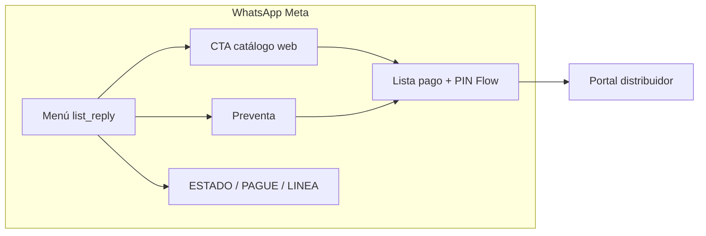

# Circa — Guía para Figma (wireframes, diagramas, componentes, journeys)

Documento **único de entrada** para diseñadores, agentes Figma MCP y stakeholders que necesiten crear o mantener diseño alineado al producto en producción.

**Canal activo en diseño:** Meta WhatsApp Cloud API (no diseñar ni documentar Twilio en material nuevo).  
**Actor principal WhatsApp:** bodeguero (dueño o representante legal de bodega preaprobada).

---

## 1. Para agentes Figma — lee esto primero

### 1.1 Qué debes producir

| Artefacto | Herramienta Figma | Dónde vive | Fuente de verdad |
|-----------|-------------------|------------|------------------|
| **Wireframes chat WhatsApp** | Design file | [Wireframes Onboarding](https://www.figma.com/design/8uXIOxgppRe67aNbThSyv6) | Specs `0X-*-whatsapp.md` + YAML onboarding |
| **Flowcharts de journey** | FigJam | [Circa - Bodeguero](https://www.figma.com/board/S3d80RJeYAIuuyGz9V9Qk0) | `docs/flows/0X-*.md` (funcional) |
| **Arquitectura / contexto** | FigJam | [Overview Diagramas](https://www.figma.com/board/FNDF15XL6aElJkAv9d7iIs) | `arquitectura.md` · [URLs por actor](./DIAGRAMA-urls-por-actor.md) |
| **Componentes reutilizables** | Design file (library) | Mismo design file o librería team | Convenciones §5 de este doc |
| **Pantallas web** (catálogo, backoffice, distribuidor) | Design file | Por crear páginas `07+` | `static/*.html` + journey `06–08` |

### 1.2 File keys (MCP / URLs)

| Recurso | Tipo | File key |
|---------|------|----------|
| Wireframes WhatsApp | Design | `8uXIOxgppRe67aNbThSyv6` |
| Flowcharts bodeguero | FigJam | `S3d80RJeYAIuuyGz9V9Qk0` |
| Overview arquitectura | FigJam | `FNDF15XL6aElJkAv9d7iIs` |

### 1.3 Workflow recomendado (MCP)

1. **Leer** el spec del journey (`01-onboarding-whatsapp.md`, etc.) y el journey técnico (`../01-onboarding.md`).
2. **Inspeccionar** frames existentes en el design file (misma convención visual).
3. **Clonar** el shell de teléfono (390×900) de `02 Conversacion completa` u otra página ya wireframeada.
4. **Nombrar** el frame exactamente como `screen_id` + título (ej. `CAT-02 CTA catálogo venta`).
5. **Copiar** textos desde spec o `app/services/meta_client.py` — no inventar copy.
6. **Añadir** caja azul «Respuesta esperada del bodeguero» en cada pantalla interactiva.
7. **Actualizar** fila en [`../scenarios.yaml`](../scenarios.yaml) si el escenario cambia.

### 1.4 Reglas duras

- Un **frame = una pantalla de chat** (o una nota web cuando el journey sale de WhatsApp).
- **No conectar** journeys distintos con flechas en un solo mega-diagrama (cada journey es independiente en FigJam).
- **IDs estables:** `ONB-01`, `CAT-03`, `PAY-07` — nunca renombrar IDs ya publicados.
- Si el código cambia copy o botones → actualizar spec `.md` **y** frame Figma en el mismo PR.

---

## 2. Qué es Circa (contexto funcional)

Circa da **crédito embebido** a bodegas en Perú. El bodeguero:

1. **Activa** su cuenta por WhatsApp (RUC, DNI, selfie, contrato, PIN).
2. **Pide** productos al distribuidor (DIMAX / Zoom) vía catálogo web in-app.
3. **Paga** contado o financia un tramo (S/100–500) con PIN de 4 dígitos.
4. **Preventa:** arma lista sin pagar; paga cuando el distribuidor acepta.
5. **Postventa:** ve pedidos, línea de crédito, reporta pagos (`PAGUE`).

Otros actores (**distribuidor**, **admin**, **soporte**) usan **portales web**, no el chat del bodeguero.

---

## 3. Mapa de journeys — funcional y técnico

Cada fila enlaza **qué ve el usuario**, **dónde está en BD** y **qué código lo implementa**.

| # | Journey (funcional) | Actor | Spec WhatsApp (Figma) | Journey técnico | Código principal | Fase BD / señal |
|---|---------------------|-------|------------------------|-----------------|------------------|-----------------|
| 1 | Onboarding y activación | bodeguero | [01-onboarding-whatsapp.md](./01-onboarding-whatsapp.md) | [01-onboarding.md](../01-onboarding.md) | `state_machine.py` (`reg_*`), `meta_client.send_*` | `welcome` → `reg_ruc` → … → `menu` |
| 2 | Catálogo y pedido | bodeguero | [02-catalogo-whatsapp.md](./02-catalogo-whatsapp.md) | [02-catalogo-pedido.md](../02-catalogo-pedido.md) | `send_menu`, `send_catalogo_flow`, `catalogo_v2.html` | `menu` → CTA → web → `submit-cart` |
| 3 | Pago y PIN | bodeguero | [03-pago-whatsapp.md](./03-pago-whatsapp.md) | [03-pago-pin.md](../03-pago-pin.md) | `catalogo._send_payment_options`, `pin_flow.py` | `pin_pago`, handlers `CONTADO_*` / `FINFIJO*` |
| 4 | Preventa | bodeguero | [04-preventa-whatsapp.md](./04-preventa-whatsapp.md) | [04-preventa.md](../04-preventa.md) | `tipo_operacion=preventa`, admin aceptar | `preventa_*` estados pedido |
| 5 | Postventa y cobranza | bodeguero | [05-postventa-whatsapp.md](./05-postventa-whatsapp.md) | [05-postventa-cobranza.md](../05-postventa-cobranza.md) | menú `ESTADO`/`PAGUE`, `cobranza.py` | `menu`, cron recordatorios |
| 6 | Portal distribuidor | distribuidor | *wireframes web pendientes* | [06-distribuidor.md](../06-distribuidor.md) | `routes/distribuidor.py`, `distribuidor.html` | — |
| 7 | Admin y ops | admin | *wireframes web pendientes* | [07-admin-ops.md](../07-admin-ops.md) | admin endpoints, migraciones | — |
| 8 | Soporte humano | agente + bodeguero | *inbox pendiente* | [08-soporte.md](../08-soporte.md) | `support/`, `/support` | escalamiento bot |
| 9 | Legacy Twilio | — | ⛔ no diseñar | [09-legacy.md](../09-legacy.md) | `/webhook/twilio` | deprecado |

**Matriz completa de escenarios (IDs, P0, estado):** [`../README.md`](../README.md) y [`../scenarios.yaml`](../scenarios.yaml).

### 3.1 Flujo alto nivel (bodeguero activo)



### 3.2 Onboarding — fases técnicas

| Paso UI (progreso) | Label | `sesiones.fase` |
|--------------------|-------|-----------------|
| 1 | Verificar negocio | `welcome`, `reg_ruc` |
| 2 | Identidad | `reg_dni`, `reg_biometria` |
| 3 | Activación | `reg_linea_acepta` |
| 4 | Contrato y clave | `reg_contrato`, `reg_pin` → `menu` |

Detalle pantalla a pantalla: [`onboarding-screens.yaml`](./onboarding-screens.yaml) (machine-readable).

**URLs por actor (bodeguero, vendedor, distribuidor, admin, soporte):** [`DIAGRAMA-urls-por-actor.md`](./DIAGRAMA-urls-por-actor.md) · FigJam en [Overview](https://www.figma.com/board/FNDF15XL6aElJkAv9d7iIs).

---

## 4. Archivos Figma existentes

### 4.1 Design — Wireframes WhatsApp

**Archivo:** [Circa - Wireframes Onboarding](https://www.figma.com/design/8uXIOxgppRe67aNbThSyv6) · key `8uXIOxgppRe67aNbThSyv6`

| Página | Contenido | Frames |
|--------|-----------|--------|
| `01 Onboarding` | Resumen ONB-01 … ONB-09 | `ONB-*` |
| `02 Conversacion completa` | Happy path 01→16 + errores E01→E06 + guía stakeholder | `01 Bienvenida` … `16 Menu principal`, `E01` … `E06` |
| `03 Catalogo` | Menú → CTA → web → repetir | `CAT-01`, `CAT-02`, `CAT-03`, `CAT-07` |
| `04 Pago` | Loading, opciones, PIN, confirmación, error PIN | `PAY-*`, `PAY-E01` |
| `05 Preventa` | Menú, CTA, confirmación, pagar preventa | `PRV-01` … `PRV-05` |
| `06 Postventa` | Pedidos, línea, PAGUE, recordatorio, verificado | `POS-01` … `POS-05` |

### 4.2 FigJam — Diagramas

| Archivo | Uso |
|---------|-----|
| [Circa - Bodeguero](https://www.figma.com/board/S3d80RJeYAIuuyGz9V9Qk0) | **Un diagrama por journey** (onboarding, catálogo, pago, preventa, postventa). Sin flechas entre journeys. |
| [Circa - Overview Diagramas](https://www.figma.com/board/FNDF15XL6aElJkAv9d7iIs) | Arquitectura: Meta webhook → FastAPI → Supabase → distribuidor. **Sin Twilio** en diagramas nuevos. |

---

## 5. Sistema de diseño — componentes a usar o crear

### 5.1 Tokens de color

| Token | Hex | Uso |
|-------|-----|-----|
| `circa/header` | `#075E54` | Barra superior chat |
| `circa/bubble-out` | `#D9FDD3` | Mensaje Circa (saliente) |
| `circa/bubble-in` | `#FFFFFF` | Mensaje bodeguero (entrante) |
| `circa/chat-bg` | `#EADFD4` aprox. | Fondo área chat |
| `circa/accent` | `#25D366` | Progreso activo, éxito |
| `circa/button-text` | `#008069` | Labels botones reply / lista |
| `circa/action-hint` | azul claro | Caja «Respuesta esperada del bodeguero» |
| `circa/error` | rojo suave + borde | Ramas E01–E06 |
| `circa/badge` | azul pálido | ID escenario + fase BD |

### 5.2 Componentes (Design file)

Crear o reutilizar como **Component Set** con variantes:

| Componente | Variantes | Notas |
|------------|-----------|-------|
| `Phone/Shell` | default | 390×900, header + badge + chat scroll |
| `Chat/Bubble` | circa · user · loading · success · error | `loading` = gris + «··· Verificando…» |
| `Chat/ButtonReply` | 1-btn · 2-btn · 3-btn | Stack vertical, separadores |
| `Chat/ListReply` | closed · open | Botón «Ver opciones» + panel filas |
| `Chat/CtaUrl` | default | Cuerpo + botón «Abrir catálogo» |
| `Chat/FlowCta` | pin-create · pin-verify | Botón que abre Flow nativo Meta |
| `Chat/ImageInbound` | dni · selfie | Placeholder gris 200×130 |
| `Meta/ProgressBar` | step-0 … step-4 | 4 segmentos onboarding |
| `Meta/ScenarioBadge` | default · error | `CAT-01 · send_menu` |
| `Meta/ActionHint` | default | Caja azul stakeholder |
| `System/Pill` | info | «Clave creada correctamente» centrado |

**Dimensiones teléfono:** 390 px ancho (iPhone lógico WhatsApp). **No** mezclar múltiples journeys en un solo frame.

### 5.3 Convención de nombres

```
{frame_id} {título corto}
Ejemplos:
  01 Bienvenida
  CAT-02 CTA catálogo venta
  E03 DNI no coincide
  PAY-01 Opciones pago
```

Prefijos por journey: `01–16`, `E01–E06`, `CAT-`, `PAY-`, `PRV-`, `POS-`, `DIS-`, `ADM-`, `SUP-`.

---

## 6. Actores e interacciones Meta

### 6.1 Actores

| ID | Quién | Superficie | En wireframe WA |
|----|-------|------------|-----------------|
| `bodeguero` | Dueño / rep. legal | WhatsApp | Burbuja blanca, derecha o según layout |
| `circa` | Bot Business | WhatsApp | Burbuja verde `#D9FDD3` |
| `sistema` | Backend / cron | Píldora o nota | Gris, no burbuja chat |
| `distribuidor` | DIMAX / Zoom | Portal web | Pantallas web aparte |
| `admin` | Operaciones Circa | Backoffice / API | Pantallas web aparte |
| `agente_soporte` | Humano Circa | Inbox `/support` | Fuera del flujo bot |

### 6.2 Tipos de interacción (`interaction_type`)

| Tipo | UI WhatsApp | Cuándo dibujarlo | Código ref. |
|------|-------------|------------------|-------------|
| `text` | Burbuja texto | Mensajes planos, errores | `meta_client.send_text` |
| `button_reply` | ≤3 botones bajo mensaje | Bienvenida, confirmaciones, términos | `send_buttons` |
| `list_reply` | Botón → lista ≤10 filas | Menú, opciones de pago | `send_list` |
| `cta_url` | Botón abre URL in-app | Catálogo v2 | `send_catalogo_flow` |
| `flow` | Botón abre WhatsApp Flow | PIN crear / verificar | `send_pin_request` |
| `image` | Media en chat | DNI, selfie | webhook inbound image |
| `loading` | Typing / procesando | Tras input usuario | delays, APIs externas |

### 6.3 Plantilla por pantalla (checklist diseñador)

Cada frame debe incluir:

- [ ] Header Circa verde
- [ ] Badge: `screen_id` · `scenario_id` · `fase_bd`
- [ ] Barra progreso (solo onboarding pasos 1–4)
- [ ] Mensajes Circa en orden cronológico
- [ ] Input bodeguero (texto, imagen, botón o lista) si aplica
- [ ] Caja **Respuesta esperada del bodeguero**
- [ ] Flecha mental al `next` screen_id (documentado en spec, no obligatorio en canvas)

Campos detallados en specs por journey; YAML onboarding: [`onboarding-screens.yaml`](./onboarding-screens.yaml).

---

## 7. Índice de specs por journey (WhatsApp)

| Journey | Spec diseño | Escenarios | Prefijo frame |
|---------|-------------|------------|---------------|
| Onboarding | [01-onboarding-whatsapp.md](./01-onboarding-whatsapp.md) | ONB-01 … ONB-11 | `01`–`16`, `E01`–`E06` |
| Catálogo | [02-catalogo-whatsapp.md](./02-catalogo-whatsapp.md) | CAT-01 … CAT-09 | `CAT-` |
| Pago | [03-pago-whatsapp.md](./03-pago-whatsapp.md) | PAY-01 … PAY-09 | `PAY-` |
| Preventa | [04-preventa-whatsapp.md](./04-preventa-whatsapp.md) | PRV-01 … PRV-06 | `PRV-` |
| Postventa | [05-postventa-whatsapp.md](./05-postventa-whatsapp.md) | POS-01 … POS-06 | `POS-` |

---

## 8. Diagramas — qué dibujar en FigJam

| Diagrama | Contenido | No incluir |
|----------|-----------|------------|
| **Journey bodeguero** (×5) | Decisiones del usuario, mensajes clave, ramas error | Twilio, APIs internas irrelevantes |
| **Secuencia pago** | submit-cart → delay 2s → lista pago → PIN → confirmado | Detalle SQL |
| **Arquitectura** | Meta → FastAPI → Supabase → distribuidor → bodeguero | Twilio (legacy) |
| **Estados pedido** | borrador → confirmado → en_camino → entregado → cobranza | — |

Referencias Mermaid en [`arquitectura.md`](../../../arquitectura.md) §4 y journeys `01–05`.

---

## 9. Datos de demo (wireframes)

Usar valores consistentes en **todos** los frames:

| Variable | Valor demo |
|----------|------------|
| `{nombre}` / bodega | Bodega El Sol |
| `{distribuidor}` | DIMAX |
| `{linea}` | 500 |
| `{ruc}` | 20123456789 |
| `{razon_social}` | BODEGA EL SOL SAC |
| `{direccion}` | Av. Principal 123, Lima |
| `{rep_legal}` / `{dni_nombre}` | Juan Pérez / Juan |
| `{dni}` | 45678901 |
| Pedido venta | CRC-2024-001 |
| Pedido preventa | PRV-2024-015 |

---

## 10. Referencia de código (copy WhatsApp)

| Área | Archivo |
|------|---------|
| Mensajes salientes | `app/services/meta_client.py` |
| Lógica fases / menú / errores | `app/state_machine.py` |
| Opciones de pago post-carrito | `app/flows/catalogo.py` → `_send_payment_options` |
| PIN Flow | `app/flows/pin_flow.py` |
| Catálogo web | `static/catalogo_v2.html` |
| Plantillas texto legacy | `app/services/messages.py` |

**Regla:** el copy en Figma debe coincidir con `meta_client.py` salvo que producto apruebe cambio explícito.

---

## 11. Pendientes de diseño (backlog Figma)

| Página | Journey | Referencia |
|--------|---------|------------|
| `07 Distribuidor` | DIS-01 … DIS-05 | `static/distribuidor.html` |
| `08 Admin` | ADM-* | `static/backoffice.html` |
| `09 Soporte` | SUP-* | `static/support_inbox.html` |
| Component library publicada | Todos | Extraer de `02 Conversacion completa` |
| Ramas PAY-04, PAY-05, PAY-06 | Pago | [03-pago-whatsapp.md](./03-pago-whatsapp.md) |
| CAT-08 sin historial, CAT-09 editar | Catálogo | [02-catalogo-whatsapp.md](./02-catalogo-whatsapp.md) |

---

## 12. Mantenimiento

1. Cambio UX → actualizar `scenarios.yaml` + journey `.md` + spec `figma/*.md` + frame Figma.
2. Nuevo escenario → siguiente ID libre (`PAY-10`, …); no reutilizar IDs ⛔.
3. Emoji en código: opcional en Figma (simplificar salvo pedido stakeholder).
4. PR de diseño: adjuntar link Figma con frames tocados.

---

## 13. Enlaces rápidos

| Recurso | URL |
|---------|-----|
| Matriz escenarios | [docs/flows/README.md](../README.md) |
| Arquitectura técnica | [arquitectura.md](../../../arquitectura.md) |
| Wireframes design file | [figma.com/design/8uXIOxgppRe67aNbThSyv6](https://www.figma.com/design/8uXIOxgppRe67aNbThSyv6) |
| Flowcharts bodeguero | [figma.com/board/S3d80RJeYAIuuyGz9V9Qk0](https://www.figma.com/board/S3d80RJeYAIuuyGz9V9Qk0) |
